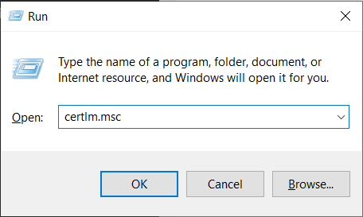
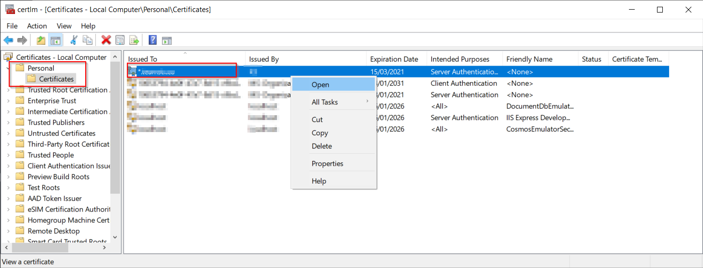
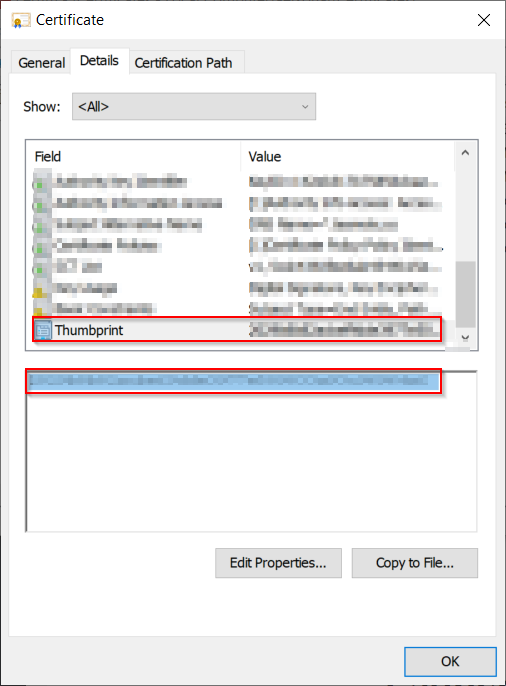

# Manual installation of your domain certificate

## About
This document explains how to manually install your domain certificate in your virtual machine or local environment. 

## Installing the certificate
Copy the [pfx certificate mentioned in the prerequisites](../prerequisites/readme.md) to your virtual machine or local environment and double click on it to run the certificate import wizard.

On the first screen, select `Local machine` as the Store Location and click `Next` (Windows may ask for administrator rights).

||
|:--:|
|*Certificate Import Wizard*|

Click `Next` on the File to import step.

In the Privacy Key Protection step, the wizard will ask for the password to read the certificate's private key, complete it and leave the rest of the settings as-is and click next.

||
|:--:|
|*Complete the password to read the certificate*|

Finally, in the Certificate Store selection, click on `Browse` and select `Personal`. Then continue with the rest of the wizard.

## Obtaining the certificate thumbprint

Later it will be necessary to obtain the certificate thumbprint to complete the botservice configuration. To obtain it press Win+R keys, complete the input with `certlm.msc` and press `Ok`.

||
|:--:|
|*Complete the input and press Ok*|

Navigate to `Certificates - Local Computer\Personal\Certificates`, search for the name of the certificate and open it (Either by double clicking or left click and open).

||
|:--:|
|*Search the certificate and open it*|

Go to details tab and search for Thumbprint field, select it, and copy its value.

||
|:--:|
|*Copy the thumbprint of the certificate*|
